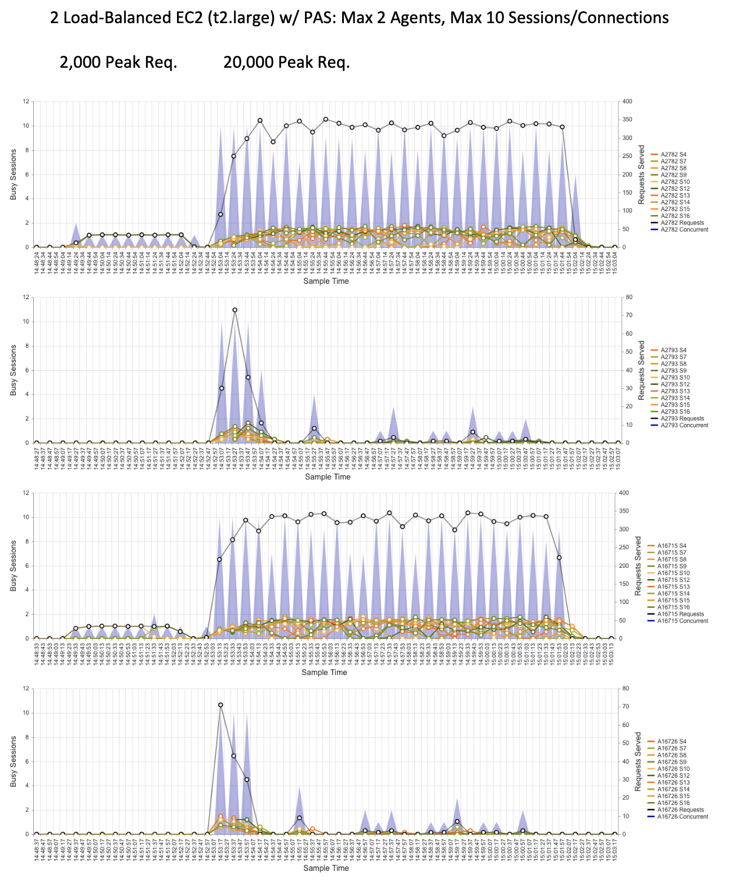
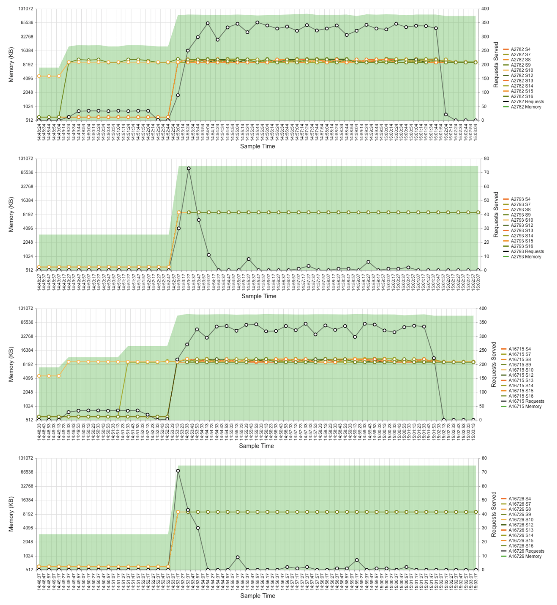
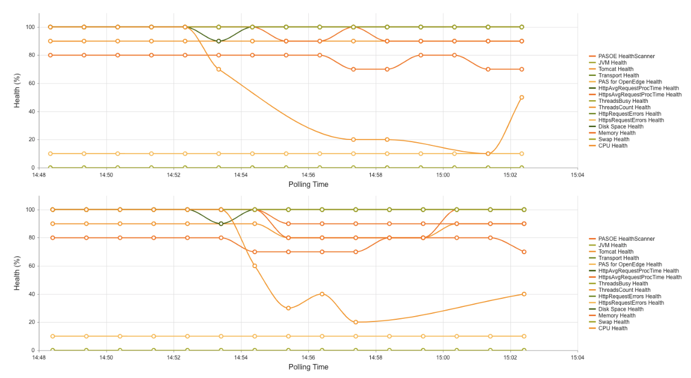

# Continuous PAS Monitoring #

## Installation & Usage ##

The provided `build.xml` files are expected to be used with the `proant` utility from within a PROENV session. You should be aware of the location of your PAS instance to be monitored along with a location where your collector/monitor endpoint may reside--the latter may be on a separate server and in fact is strongly encouraged. The primary 2 folders contain the artifacts for tailoring the Application and Collector instances, respectively. For a comprehensive history and listing of all commands, see the file `Pulse_Metrics_Enablement.pdf` in this directory (which focuses more on the approach for OpenEdge 12.2+).

**For all of the proceeding instructions, you should utilize a PROENV session to make DLC and all necessary utilities available in your system path.**

Running `proant` from within each of the Application or Collection directories will provide a list of commands and options.

### Application - PAS Integration ###

1. Place the **Application** folder on the host machine where you wish to gather metrics from a PAS instance.
1. From within a `PROENV` session, navigate to the **Application** folder.
1. **OPTIONAL:** If you DO NOT have a PAS installation you wish to monitor, you may use the `proant create` target to create a plain **oepas1** instance in a WRK directory of your choosing.
	- Additionally, there is a `proant deploy_demos` target which will add some sample code to an instance and will provide some testing endpoints accessible via the WEB transport.
	- Values such as the instance, ablapp, and webapp names can be modified as necessary for this deployment step.
1. Execute `proant deploy_metrics` to integrate the metrics-gathering feature to a target instance.
	- Adjust the available parameters as necessary to change your path and target for the PAS instance to tailor.
	- **Be certain to change the monitor instance's IP and port as necessary for data collection!**
	- This will tailor the instance depending on the OpenEdge version, using either the **Spark Diagnostics** (11.7.8+) or **LiveDiag** (12.2.4+) pattern as applicable.
1. Start the target instance and confirm operation of the PAS instance at `http://HOSTNAME:PORT` as applicable.

**Note 1:** For the **LiveDiag** solution in OpenEdge 12.2.4+ a set of R-code (.r files) will be deployed into the `CATALINA_BASE/openedge` location which is expected to be in the application PROPATH (to which a new sub-folder structure will be added: OpenEdge/ApplicationServer/). These files override some of the product-supplied ABL code which drives the Profiler and LiveDiag collection features and allows pushing that data to a customized, remote collection endpoint using the ABL HttpClient library. It is anticipated that a variation of this code may become part of the standard product installation in the future.

**Note 2:** The R-code is compiled against the LTS release (12.2) by default, and may need to be recompiled for other versions of OpenEdge (read: later versions). To do so, there is an undocumented `compile` target for the proant utility which will recompile the code and place it into the correct deployment directory. From there the `deploy_metrics` will copy the R-code to the correct location. This step will of course require the "4GL Development" license, though once compiled the files can be deployed anywhere the same version of OpenEdge is installed.

**Note 3:** When specifying the ABL Application name for any utilities or command line options, it is necessary to use the exact same case as the openedge.properties file and reported by the PAS instance. Due to the use of JSON objects to pass many of the commands to the instance these values should be treated as case-sensitive.

### Collector - Metrics Visualization ###

**Notice:** This instance assumes availability of ports 8850, 8851, 8852, and 8853 for the PAS instance, with 8854 for the database by default.

1. Place the **Collector** folder on the host machine where you wish to have all metrics reported.
	- This machine must be able to at least receive TCP connections on port 8850 (for HTTP) or 8851 (for HTTPS).
1. From within a PROENV session, navigate to the **Collector** folder.
1. Execute `proant create` to create both the **pasmon** database and **monitor** PAS instance.
1. Confirm creation of the PAS instance at the configured WRK folder, with a /db/ folder within that.
1. Start the **monitor** instance via `proant startup`.
1. Confirm operation at `http://MONITOR_IP:PORT` (eg. [http://localhost:8850](http://localhost:8850))

For reference, the following actions are taken during the "create" process:

- A new PAS instance called "*monitor*" is created at the configured WRK directory.
- A new local database called "*pasmon*" is created at `CATALINA_BASE/db/`.
- The configured WebApp is updated with items from a custom `ui.zip` file contents.
- ABL code is placed within the `ablapps` folder, including the DOH .map files.
- The PAS instance is tailored with a basic `startup.pf` and a WebHandler endpoint.
- Database startup/shutdown scripts are added to the /bin/ directory.

**Note:** As part of the installation/configuration of this instance, the included **pasmon** database should be automatically started (\_mprosrv) and stopped (\_mprshut) as part of the normal operation of the PAS instance (read: it is not necessary to create a dedicated database server).

## Metrics Generation ##

The following instructions assumes testing against a PAS instance **with the demo code deployed**. If you are monitoring your own PAS instance (not oepas1) please execute any desired tests as normal and skip to the **Enabling Collection** steps.

1. Download and install the [JMeter](https://jmeter.apache.org/download_jmeter.cgi) application to assist with further testing.
1. Open the **Application/RunTests.jmx** file, making sure to adjust the server IP and port in the **HTTP Request** section to match your demo environment.
1. The test should confirm proper operation of the RESTful API endpoints and place stress on the server for a period of 10 minutes.
1. Before execution of the JMeter script, perform the instructions below for enabling collection on your PAS instance, depending on the OpenEdge version and type of solution deployed.

### Enabling Collection: ###

For reference, the location of the collection "monitor" instance should have been factored into the enablement scripts during the preceding deployment to the target PAS instance. Though some minor work is needed to enable the **LiveDiag** collection on the monitored PAS instance.

**11.7.x (Spark Diagnostics):** Configured via the `metrics_config.json` file...

- Collection should start automatically on each MSAgent-session after the initial timeout period, once the ABL Application of the instance being monitored begins receiving requests.
- By default the memory, ABLObjects, and requests will be tracked per-session and reported every 2 minutes.

**12.2+ (LiveDiag):** You must enable collection on a per-process basis...

**Option 1: ABL Procedure**

1. From within the Collection folder, execute the `proant metrics` command to begin collecting the default metrics using either default or supplied options from the command.
	- This executes a .p which may require a 4GLDev license.
	- If necessary, adjust the instance, ablapp, and monitor values.
	- This will first query the PAS instance for MSAgents running for the ablapp.
	- Metrics will be enabled for each agent and sent to the configured monitor IP and port.
1. Use the `-Dstate=off` property to disable the metrics collection.

**Option 2: Batch/Shell Commands**

1. Navigate to the **CATALINA_BASE/bin** location of your monitored instance.
1. Execute the `agents.[bat|sh]` utility to generate a list of PID's for the configured ABL Application.
	- By default "oepas1" will be used (unless previously overridden by the -Dabpapp property while tailoring).
	- If needed, adjust the script's "ABL\_APP\_NAME" variable to search for agents belonging to another ABL Application.
1. Feed each PID into the pulse enablement script via `pulse_on.[bat|sh] #` where \# is the PID. The utility will report that it is setting up the script for each PID.
	- You may check the output in a `pulse_on_#.out` file for each PID you enable.
1. Collection will start immediately and continue every 20 seconds (by default).
1. To disable the LiveDiag metrics, run the `pulse_off.[bat|sh]` passing the PID to disable.
	- You may check the output in a `pulse_off_#.out` file for each PID you disable.

At this point you may execute any tests against the monitored PAS instance and begin checking for results in the UI of the monitor instance at `http:MONITOR_IP:PORT` (eg. [http://localhost:8850](http://localhost:8850)).

## Results Interpretation ##

With the tests executed and results gathered, it should be possible to see an increase in both per-session memory and the count of ABLObjects present. These trends will be seen in the graph of memory and objects as outlined in the process below.

1. Return to the **Monitor** application at [http://localhost:8850](http://localhost:8850)
1. The dropdown to the right of the **PASOE Stats** text may initially be blank, when no data has been reported to the server yet. As metrics are sent to the Monitor instance you may need to refresh the page to reflect any changes.
1. Once an entry for "**InstanceName / [ServerIP:Port]**" appears in the dropdown, make sure that option is selected and you should then be able to select an option from the "**Agent/Session**" dropdown for further review.
1. As you cycle through the available agents and sessions any recorded results should appear in the **Memory/Objects** graph in the tab set in the lower half of the screen. The two lines plotted should have their corresponding scales along the vertical access on each side of the graph (memory to the left, object count to the right).
1. You may look at the other tabs to review various aspects of data collected from the monitored instance:
	- Statistics Overview - A summary of all agent and session statistics gathered for the application.
	- Memory/Objects - Reports the selected session's trend of memory consumption to ABL Objects.
	- Agent Activity - Provides a graphic for 3 key metrics:
		- Concurrent Sessions: Activity over time, including counts of requests serviced by each session at that moment.
		- Session Memory: Use over time for the agent, including overhead memory when available (OpenEdge 12.2+).
		- Agent Lifetime: Total sessions started over the life of the session, including session and overhead memory totals.
	- ABL Requests - Sequential list of requests for ABL code execution.
	- Tomcat Access Logs - Provided after the shut-down of the monitored PAS instance (Spark-Diagnostics only).
	- Profiler Data - ABL Profiler output, if enabled for collection (not covered here).
	- Health Trends - Reserved for displaying trends from the HealthScanner (not covered here).

### Sample Scenario ###

For a sample of the possible output, we can view a comparison using the following scenario. The graphs represent 2 agents in use on 2 PAS instances, on a pair of load-balanced servers. In the first stress test only 2,000 requests were made to a load balancer which required 1-2 concurrent sessions to be used on the first agent of each server. Increasing the total requests 10x to 20,000 used all 10 sessions on each first agent, and 2-3 sessions on the second agent. With the scenario stated, we can observe a few key points:

- The solid black line shows the collective number of requests serviced by all sessions on each agent, and the values were consistent across the agents for both tests--this indicates the load balancer was effective at sending equal requests to each server and the PAS instances behaved identically.

- Another phenomenon we can observe is that as the stress test started, there was an initial spike of activity on the second agents--this was due to setting the numInitialSessions to 5. Thus, we can see precisely when the first agent needed to start additional sessions to handle the load. Once all 10 sessions were started on that first agent the number of requests to the second agent dropped significantly.

Tracking memory is another good metric to observe. Viewing the Session Memory graph for each agent we can see the cumulative memory for each agent over time, along with the memory reported by each session. In this case we see a plateau in use once all the necessary sessions have been started to service the requests. Thus, we can assume there are no memory leaks here!

When configured, data from the HealthScanner for OpenEdge can be sent as a ProDataSet, collected, and graphed accordingly. Based on the same timeline as the tests above, we can see metric for the health of the CPU did drop significantly for both servers during the latter tests, and began to recover when the tests were halted.

## Troubleshooting ##

Is something not working as expected? Are you running tests but not getting data? Don't worry, there's probably a very simple reason and we need to discover what is really happening behind the scenes.There are logging features built-in to all solutions and we just need to ensure these are fully enabled when debugging the diagnostics. In all cases where things go wrong is it encouraged that you look at all available instance log files for clues. This includes both the /logs/ directory and especially the /temp/ directory which is the default location for many of the custom, disposable files for the diagnostics.

### Application ###

1. Open the `logging.config` file which should exist in your PROPATH (default: CATALINA_BASE/openedge).
2. For the respective solution implemented:
	- **Spark-Diagnostics:** Look for the **"Spark.Diagnostic.Util.RemoteMetrics"**, **"Spark.Diagnostic.Util.OEMetrics"**, and **"AgentMetrics"** properties in the JSON file.
	- **LiveDiag:** Look for the **"PushLiveDiag"** and **"OpenEdge.ApplicationServer.Service"** properties in the JSON file.
3. Set the **logLevel** property in these objects to DEBUG or TRACE. Note that TRACE may output many additional files into your PAS instance's session temporary directory location.
4. Stop your PAS instance if possible, remove all existing log files, and restart the instance for a clean slate.
5. Inspect the PAS instance's `/temp/` directory for any .log files produced from the logger output.

### Collector ###

1. Open the `logging.config` file which should exist in your PROPATH (default: CATALINA_BASE/openedge).
2. Look for the **"Business.Intake"** property in the JSON file.
3. Set the **logLevel** property in this object to DEBUG or TRACE. Note that TRACE may output many additional files into your PAS instance's session temporary directory location.
4. Stop your PAS instance if possible, remove all existing log files, and restart the instance for a clean slate.
5. Inspect the PAS instance's `/temp/` directory for any .log files produced from the logger output.

**Next Steps**

Once the instances are restarted with the increased verbosity in logging, re-run any tests for several minutes (at least 2x the "outputInterval" of time for the metrics collection) and examine the various log files produced:

- Application: Look to the /temp/ folder for information about the overall metrics behavior (OEMetrics* log files) or the internal requests to the OEManager for data (Actions* log files).
- Collector: Look to the /temp/intake/ folder for the intake.log file as well as any dumped data which was sent to the instance for collection.