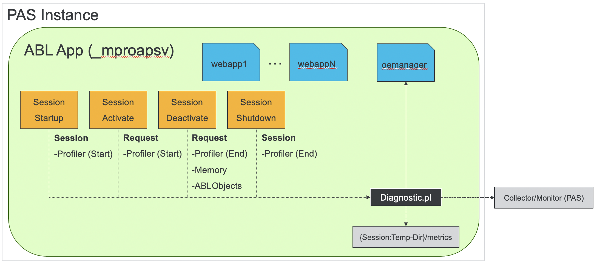
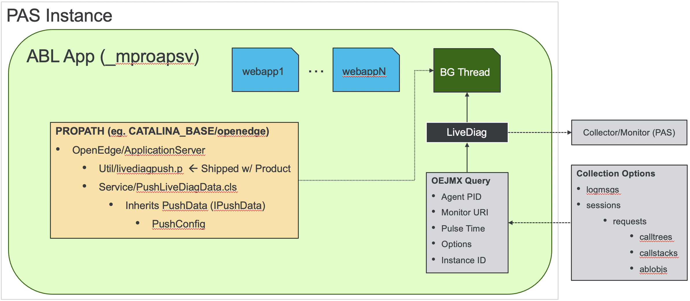
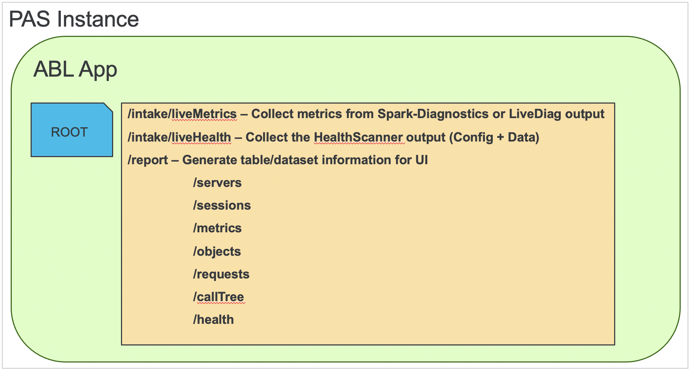

# Continuous PAS Monitoring #

## Purpose ##

PAS for OpenEdge supplies the means of collecting runtime metrics via OEJMX queries or the OEManager REST API endpoints. However, the resulting data from these endpoints represent a single moment in time and may not represent trending data which could be useful for analysis over time. For that, we need to provide a mechanism to automatically and repeatedly collect data in a manner which is ideally both transparent to the end-user or an administrator, and does not degrade application performance.

To offer such a solution there are 2 options in this directory meant as internal, unsupported features and their deployment is dependent on the OpenEdge version in which a PAS instance runs:

- **11.7.x** - Via the **Spark Diagnostic** library and its supporting code.
- **12.2+** - Via the (currently experimental) **LiveDiag** debug feature.

## Requirements ##

In order to utilize the included tooling you must have installed OpenEdge 11.7 with SP4 or later, or OpenEdge 12.2 or later (read: 12.3, 12.4, etc.). Please note that OpenEdge versions 12.0 and 12.1 are not supported and it is highly recommended to upgrade to the OpenEdge 12.2 LTS release if currently using these versions.

Depending on the major OE version, the necessary solution for metrics will be deployed to the target PAS instance and the collection point may be installed on either OpenEdge version. For OpenEdge 11.7.x the tailoring process must install the `oemanager` WebApp for metrics if it is not already deployed.

## Disclaimer ##

Use of these tools in a production environment is not recommended **UNLESS** they have been fully tested in a non-production environment first without observing any adverse effects. In some configurations the resulting data collected **MAY** have an impact on performance due to producing highly verbose information for collection.

## Overview ##

Each of the available solutions are enabled through different means, though both are intended to collect similar data and deliver the information to a centralized location for further on-demand analysis. The choice of solution depends primarily on the OpenEdge version installed for PAS use:

**OpenEdge 11.7.x** - The **Spark Diagnostic** approach is intended for 11.7.x and requires the `Diagnostic.pl` from the [Spark-Toolkit](https://github.com/progress/Spark-Toolkit) be installed and utilized for a PAS instance, with the PL file added to the PROPATH. Additionally, the `session[Startup|Activate|Deactivate|Shutdown]Proc` settings must be updated in the instance to trigger the necessary ABL logic which communicates with the OEManager webapp. Naturally, this instrumentation must work in conjunction with the existing business application and requires more configuration before it can be enabled. This is the only solution for OpenEdge 11.7.x installations (ideally 11.7.4+), and for numerous reasons is not recommended for a production environment.

Per the disclaimer above, use of the **Spark-Diagnostic** solution will cause a more noticeable impact in performance of an application due to the need to request data at the end of a request boundary.

**OpenEdge 12.2+** - The **LiveDiag** approach merely requires OpenEdge 12.2 (LTS) or later versions to be installed and utilized for a PAS instance. This approach currently uses an undocumented debugging endpoint accessible only via OEJMX query to enable or disable collection. As the underlying API is not yet formalized, these actions are performed via provided batch/shell commands to help automate the process. The only configuration needed is to adjust those commands to collect the appropriate data at runtime, and to add some OpenEdge namespaced procedures and classes into the PROPATH to support the collection endpoint.

Another difference between the 2 solutions for metrics (beyond how they enabled or instrumented) is in how often they report metrics:

- For the **Spark Diagnostic** solution there is a timeout between each push to the collection endpoint which is dependent on server activity. Meaning, the timeout is only checked when a request is made to a particular MSAgent-session, and if the timeout interval has elapsed since the last send of data then new metrics will be collected. This unfortunately creates a gap in collection if no requests are serviced by a normally-idle MSAgent-session.
- Conversely, the **LiveDiag** feature has been called "Pulse Metrics" because it behaves like a heartbeat. When enabled it will ALWAYS send a payload of metrics to the collection endpoint every N seconds, regardless of whether any requests were serviced by the MSAgent process or not. This makes collection more consistent and accurate as it can report on idle MSAgent-sessions and even in-flight requests that may cross the boundary between multiple "pulses".

Both means of collection are capable of sending data on a routine basis to an external location for collection (provided that network policy allows this). This endpoint is referred to here as the "**monitor**" which is a PAS instance that utilizes a custom database for storage of parsed data. All services are RESTful for both collection and reporting, and a simple UI is provided for generating user-friendly data trends.

## Differentiation ##

For reference, these solutions are not the same as the [OpenEdge HealthScanner](https://docs.progress.com/bundle/pas-for-openedge-management/page/Use-the-OpenEdge-HealthScanner.html) as they differ in several key ways:

- The **OpenEdge HealthScanner** is primarily intended for production servers and is a supported, documented feature of the PAS for OpenEdge product.
- The **OpenEdge HealthScanner** reports a single, weighted score to represent the overall health of a server.
- The **Spark Diagnostic** and **LiveDiag** solutions are focused on specific ABL and Tomcat metrics direct from configured PAS instances, and does not consider the host OS memory, CPU, etc.
- The **OpenEdge HealthScanner** does not retain individual measurements over time, and is meant to be an on-demand snapshot.
- The **Spark Diagnostic** and **LiveDiag** metrics are collected from across all ABL Applications in a PAS instance over time, are stored persistently, and meant for use in trend analysis.

## Installation & Usage ##

Please view the [supplemental Install guide](INSTALL.md) for instructions.

## Feedback ##

During the review of this content please consider the following:

- Did you encounter any issues with the content or processes?
- Were the provided instructions clear and concise?
- What do you feel worked well during the process?
- What steps did you consider as difficult to follow?
- Opinion on the UI design (eg. could you easily locate relevant data points)?
- Any feedback on this proposed solution or its relevance to your own applications?
